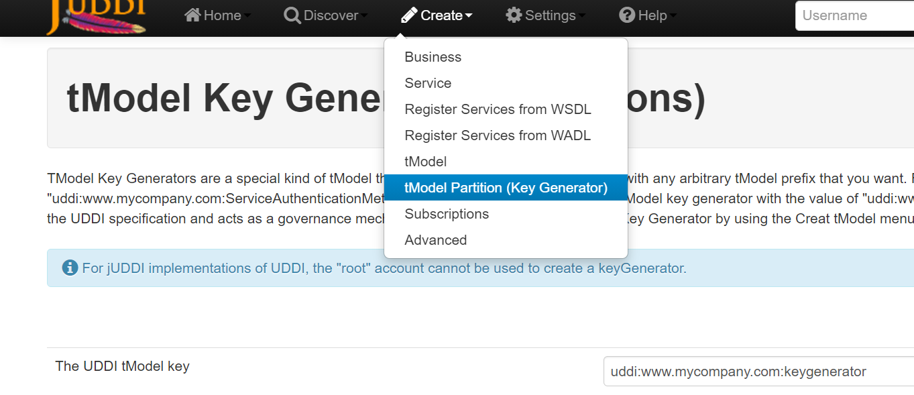
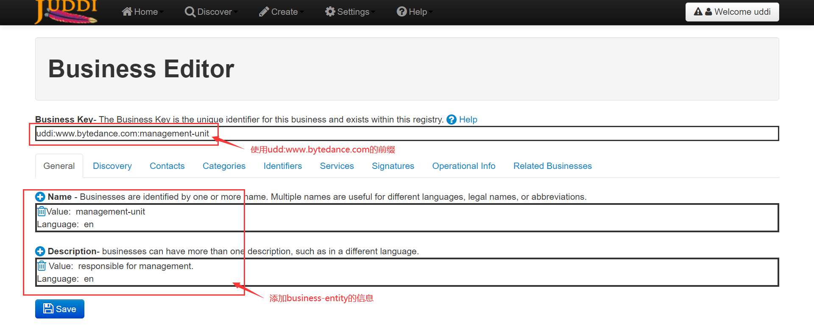
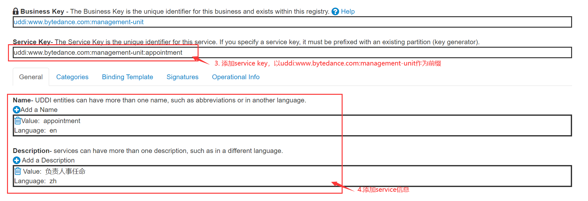
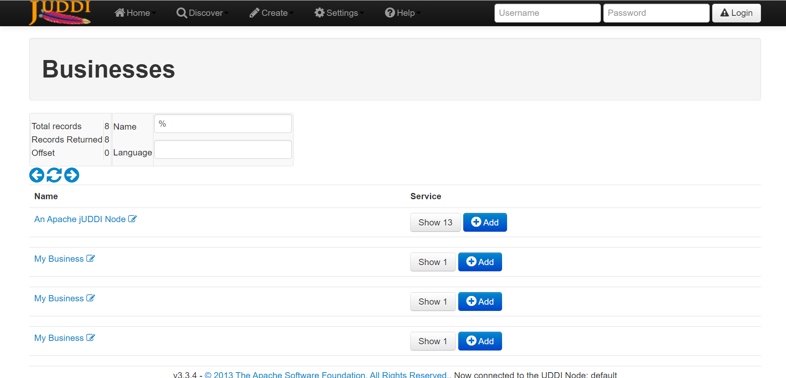

# 服务计算 juddi实验
## 一、环境
- __jdk=1.8(1.6+), maven=3.0.4, juddi=3.3.4__
## 二、部署
1.  进入<http://archive.apache.org/dist/juddi/juddi/3.3.4/>下载 ___juddi-distro-3.3.4.zip（or tar.gz）___，解压到本地 
   
   
2.  使用内置tomcat
   - ___cd___ __your/path/juddi-distro-3.3.4/juddi-tomcat-3.3.4/bin__
   - __./catalina.bat run__
   
   
   
   - 访问 __localhost:8080__，打开juddi启动页面
   
   
   

## 三、实验：服务的注册和查询
### 1. 通过juddi用户界面
- __点击jUDDI User Interface，进入用户界面__

   
  
  
- __点击右上角登录__
- __create tModel Partition(Key Generator)__
  
  
  TModel密钥生成器是tModel的一种特殊类型，借助它可以使用所需的任意tModel前缀定义新的tModel。例如，如果您希望将tModel定义为 `uddi:www.mycompany.com:ServiceAuthenticationMethod`, 则首先必须创建一个值为 `uddi:www.mycompany.com:keyGenerator` 的tModel密钥生成器。这是UDDI规范的一部分，同时充当管理机制。
- __创建一个bytedance的key generator__

  
  
- __create business， 使用创建的bytedance的key generator作为前缀__

  
  
- __create service，创建服务__
  每个business entity下包含多个服务service

   首先生成以 ___business entity为前缀的key generator___，例如`uddi:www.bytedance.com:management-unit:keygenerator`
   
  
  
  然后创建服务
  
  
  
  
- __查询__

  
  

### 2. 通过接口
[Examples](examples/)
